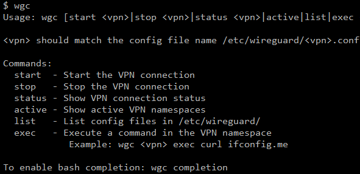
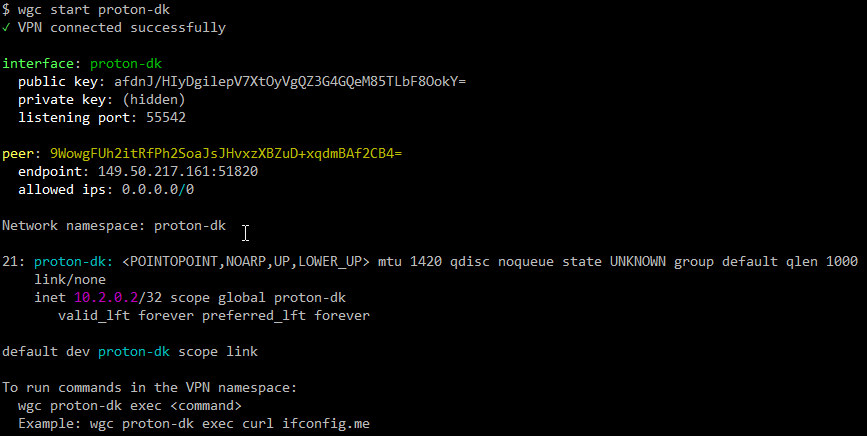
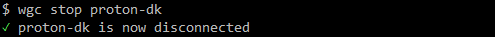
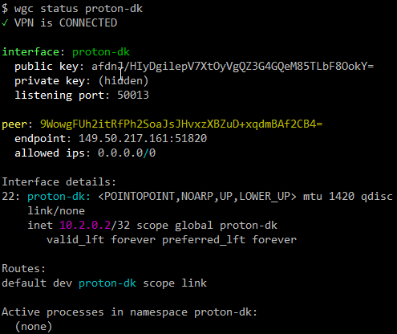
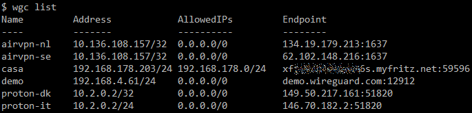
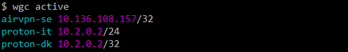

#  wgc - WireGuard Connection Manager


**[🇬🇧 English](README.md) | [🇮🇹 Italiano](README.it.md)**

> Run and monitor multiple isolated WireGuard tunnels using Linux network namespaces.

`wgc` is a bash script for managing multiple, simultaneous WireGuard connections on a Linux system. Its core feature is the use of **Linux network namespaces** (`ip netns`).

Each VPN connection is brought up inside an isolated namespace, which gets its own network interface, routing table, and DNS configuration. This allows multiple VPNs to be active concurrently without route conflicts, and it isolates the VPN traffic from the host system's main network.

---

## Features

* **Total Isolation:** Run multiple VPNs at the same time. Each VPN's traffic is completely separate from the host and other VPNs.
* **Targeted Execution:** Run specific commands or applications (like `curl`, `ssh`, or a browser) *inside* a VPN namespace. This routes only that application's traffic through the tunnel, while the rest of your system uses the default connection.
* **Automatic DNS:** Automatically sets the DNS servers specified in the `.conf` file (via the `DNS =` key) for the namespace by writing to `/etc/netns/<vpn_name>/resolv.conf`. 
* **Simple Interface:** A single script with clear commands to start, stop, list, and monitor tunnels. 

## Requirements

* `bash`
* `sudo` access (the script auto-elevates if not run as root) 
* `wireguard-tools` (provides the `wg` command) 
* `iproute2` (provides the `ip` command) 

## Installation

1. Download file [wgc](https://github.com/colemar/wgc/raw/refs/heads/main/wgc)

2. Make the script executable:
   
   ```bash
   chmod +x wgc
   ```

3. Move the script to a directory in your `$PATH`, such as `/usr/local/bin`:
   
   ```bash
   sudo cp wgc /usr/local/bin/wgc
   ```

## Configuration

Your WireGuard configuration files (`.conf`) must be placed in `/etc/wireguard/`. 

The script uses the filename (without the `.conf` extension) as the VPN identifier. For example, a file at `/etc/wireguard/work-vpn.conf` will be managed as the `work-vpn` VPN.

The script parses the file and expects standard WireGuard keys. 

* **Required Keys:** The script will exit if any key of these is missing:
  * `Address` 
  * `PrivateKey` 
  * `PublicKey` 
  * `Endpoint` 
  * `AllowedIPs` 
* **Optional Keys:** The script also supports:
  * `DNS`
  * `MTU` 
  * `PresharedKey` 
  * `PersistentKeepalive` 

---

## Usage

The general syntax is `wgc [command] <vpn_name>`.

The script requires `sudo` or root access because it manipulates network interfaces and namespaces.

  

### Main Commands

* **`start <vpn>`**
  Starts the specified VPN connection.
  
  ```bash
  wgc start work-vpn
  ```

  

* **`stop <vpn>`**
  Stops the VPN connection.
  
  ```bash
  wgc stop work-vpn
  ```

  

* **`status <vpn>`**
  Shows the detailed status of the connection.
  
  ```bash
  wgc status work-vpn
  ```

  

* **`exec <vpn> <command...>`**
  Executes a command *inside* the VPN's namespace. 
  
    *Example: Check your public IP as seen by the VPN.*
  
  ```bash
  wgc exec work-vpn curl ifconfig.me
  ```
  
    *Example: Start an interactive shell that uses the VPN.*
  
  ```bash
  wgc exec work-vpn bash
  ```

  

* **`list`**
  Lists all available `.conf` files found in `/etc/wireguard/`. 
  
  ```bash
  wgc list
  ```

  

* **`active`**
  Lists all *currently active* VPNs by checking for running network namespaces that contain a namesake WireGuard interface. 
  
  ```bash
  wgc active
  ```

  


### Bash Completion

The script can install its own bash completion file. 

1. Run the following command:
   
   ```bash
   wgc completion
   ```

2. This will create the file `/etc/bash_completion.d/wgc`. 

3. Source the file or start a new shell to use the completion. 

4. The script provides optional instructions for `sudoers` rules to make completion seamless. 

## License

This project is licensed under the GNU General Public License v3.0 (GPL-3.0).
See the [LICENSE](LICENSE) file for details.

